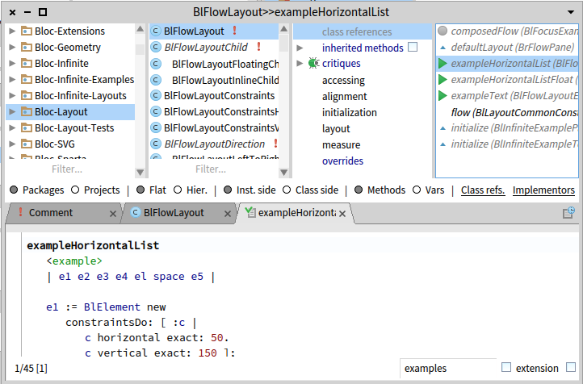

# Calypso Extensions

Calypso is a system browser for Pharo, see
[GitHub repository](https://github.com/dionisiydk/Calypso) for more
information.

## Installation

```Smalltalk
Metacello new
  baseline: 'CalypsoExtensions';
  repository: 'github://JurajKubelka/CalypsoExtensions';
  load.
```
  
To make Calypso default toolset evaluate:

```Smalltalk
ClyBrowser beAllDefault.
```

And to open browser evaluate:

```Smalltalk
ClySystemBrowser open.
```

## Class References as method protocol item

The repository includes a Calypso plugin that shows class references
in the system browser.



